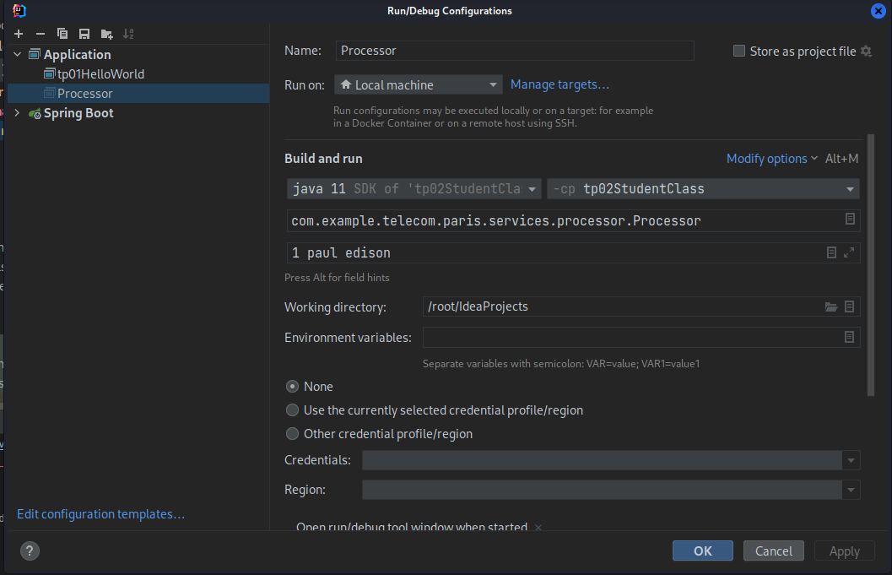
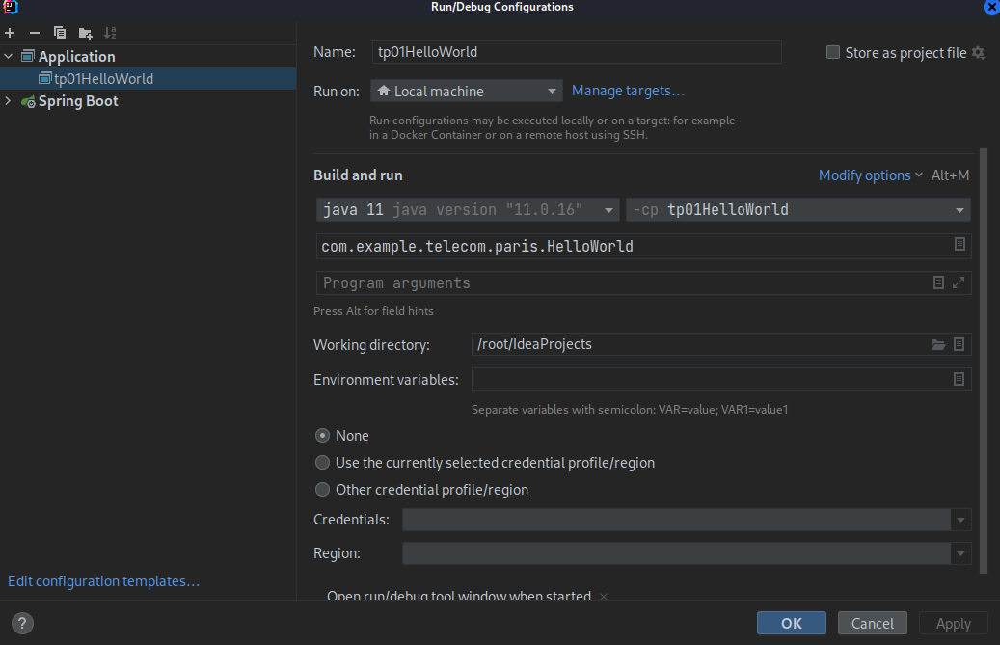

Sujet 1  Premier programme Java "HelloWorld" avec Intellij & Maven

1 - Launch in **_Terminal command_** : **mvn clean install**  

2 - Create a launcher with **Edit Configuration**  

3 - Launch Application   
